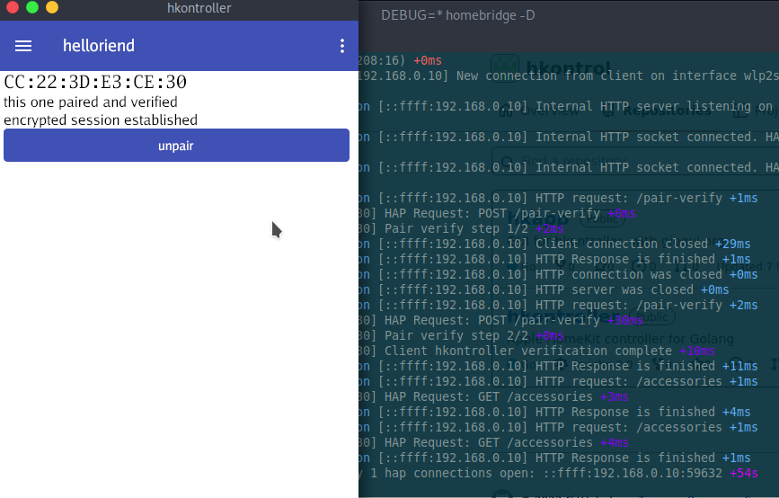

# hkapp

GUI homekit controller.

Current status: Proof of Concept.

Works: pairing, getting accessory list, changing switch characteristic value.



# contributing

This project currently is early draft and there is a lot to do. 
Any contribution is welcome.
If you want to help you may open issue, create pull request or spread a word about this project.

# android

to build apk:

```text
ANDROID_SDK_ROOT=$HOME/Android/Sdk/ gogio -target android -buildmode archive -x -appid tech.bobalus.hkapp ./
```

copy `hkapp.aar` to `./android/app/libs` then open android dir in AndroidStudio and run build.

